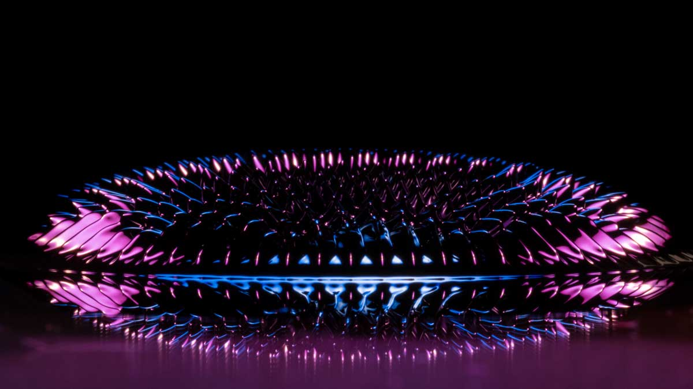
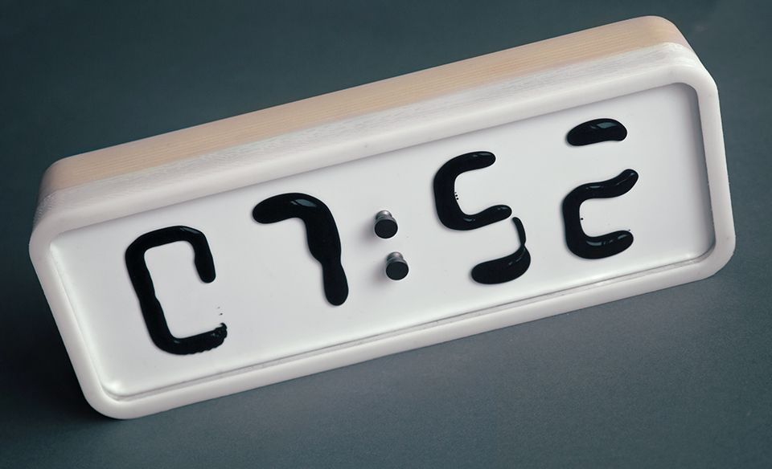

  
<!--
*** Thanks for checking out this README Template. If you have a suggestion that would
*** make this better, please fork the ferrofluid_display and create a pull request or simply open
*** an issue with the tag "enhancement".
*** Thanks again! Now go create something AMAZING! :D
***
***
***
*** To avoid retyping too much info. Do a search and replace for the following:
*** enricocirignaco(github_username), ferrofluid_display(repo), e.cirignaco@gmail.com(email)
-->

<!-- PROJECT LOGO -->
 

    
  </a>

  <h2 align="center">ferrofluid_display</h2>

  

    IDPA Project Thesis of Severin Lötscher, Lukas Germann and Enrico Cirignaco.  A Ferroflid clock with magnets.
     
     
    <a href="https://github.com/enricocirignaco/ferrofluid_display/issues">Report Bug</a>
    ·
    <a href="https://github.com/enricocirignaco/ferrofluid_display/issues">Request Feature</a>
  

<!-- TABLE OF CONTENTS -->
## Table of Contents

* [About the Project](#about-the-project)
  * [Starting Situation](#starting-situation)
  * [Aim](#aim)
  * [Product Requirements](#product-requirements)
  * [Current Status](#curent-status)
* [Getting Started](#getting-started)
  * [Toolchain](#Toolchain)
  * [Hardware](#hardware)
  * [Firmware](#firmware)
  * [Sofware(Linux)](#software)
    * [Prerequisites](#prerequisites)
    * [Installation](#installation)
* [Usage](#usage)
* [Contributing](#contributing)
* [License](#license)
* [Contact](#contact)

<!-- ABOUT THE PROJECT -->
# About The Project
Develop and Build an affordable alternative to the expensive commercially available Clocks based on Ferrofluid.

### Starting Situation

The team was searching for a cool project for our IDPA Project Thesis. We wanted at all costs the project to have something to do with electronic. That's because we are actually a class of electronic technicians. We already had the idea of building a Ferrofluid Clock in the past. We abandoned the idea because of lack of time resources. Now it's the right moment! We have rough six months time and we have to follow some quidelines regarding the documentation give by our tutors.

### Aim
Develop and Build an affordable ferrofluid clock that can display at least minutes and hours.
Documentate the whole project and finally present the product to our tutors.

### Product Reqirements
* 2 digit for hours and two digit for minutes.
* Built from widely available materials
* Use electromagnets to control ferrofluid.
* Power button.
* UI to be able to set the time.
* Affordable

### Current Status (01.10.2020)
At the moment different chemicals and ferrofluid sort are beeing tested and the electric schematics are in development.

# Getting Started
### Toolchain

* [Altium Designer](https://altium.com)
* [Visual Studio Code](https://code.visualstudio.com/)
* [STM32CubeMX](https://www.st.com/en/development-tools/stm32cubemx.html)
* [Autodesk Fuson 360](https://www.autodesk.com/products/fusion-360/overview)

### Hardware

We opted for a modular design, so we can test small series at the beginning and then scale it up. Every module have 32 outputs for the electromagnets. the modules can be connected to each other and comunicate via I2C.

#### ****Work in Progress
#### Power Supply
##### Power requirements
Sum of current consumption by the 3V3 components.

* MCU: max 120mA
* NPN Array: max 1.35mA x32 --> 43.2mA
* Driver: max 10mA x2 --> 20mA
* Total: 183.2mA

#### ****Work in Progress

### Firmware
### Software (Linux)
#### Prerequisites
#### Installation
## Usage

## Contributing
Contributions are what make the open source community such an amazing place to be learn, inspire, and create. Any contributions you make are greatly appreciated.

1. Fork the Project
2. Create your Feature Branch (`git checkout -b feature/AmazingFeature`)
3. Commit your Changes (`git commit -m 'Add some AmazingFeature'`)
4. Push to the Branch (`git push origin feature/AmazingFeature`)
5. Open a Pull Request

## License

## Contact

Severin Lötscher - e.cirignaco@gmail.com

Lukas Germann - e.cirignaco@gmail.com

Enrico Cirignaco - e.cirignaco@gmail.com

Project Link: [https://github.com/enricocirignaco/ferrofluid_display](https://github.com/enricocirignaco/ferrofluid_display)
